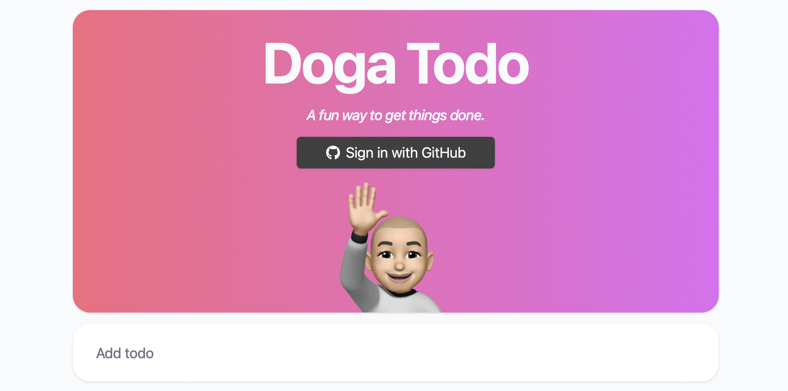
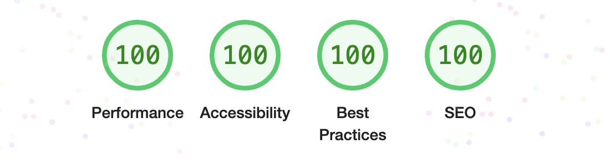

	 
	
   
   
	<h1>Doga Todo</h1>
	

		<i>A fun way to get things done.</i>
	

	 

I started this project because there were a few technologies and services that I wanted to try out. I hadn't had the chance to work with these technologies at my day job, so I figured the best way to learn these technologies would be to build something with them. Doga Todo is the result. Check out the deployed version of the app <a href="https://doga-todo.vercel.app">here</a>.

Of course the app had to look good and be performant as well. Now I know a lot of design decisions are subjective, but at least we have a way to quantify performance. My goal was to get a perfect score using Google Lighthouse, and luckily I was able to do so.

   
  
  
   
   

If you're a developer yourself, feel free to look around and gain inspiration from the code. If you have suggestions on how to improve the design and/or code, don't hesitate to let me know!

# Technologies and services used:

- <a href="https://www.typescriptlang.org">TypeScript</a>
- <a href="https://nextjs.org">Next.js</a>
- <a href="https://tailwindcss.com">Tailwind</a>
- <a href="https://vercel.com">Vercel</a>
- <a href="https://xata.io">Xata</a>
- <a href="https://tanstack.com/query">React Query</a>
- <a href="https://developer.mozilla.org/en-US/docs/Web/API/IndexedDB_API">IndexedDB</a>
- <a href="https://www.framer.com/motion/">Framer Motion</a>
- <a href="https://testing-library.com">React Testing Library</a>
- <a href="https://playwright.dev">Playwright</a>
- <a href="https://github.com/features/actions">GitHub Actions</a>
